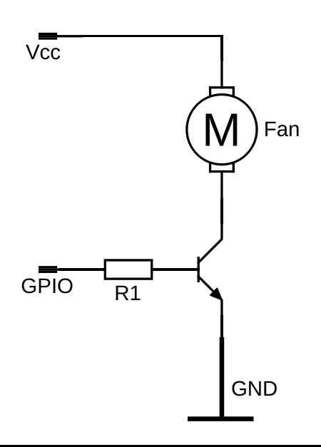

# raspifan

A lightweight Raspberry Pi fan controller written in Go. It monitors CPU
temperature and automatically switches a GPIO-controlled fan on or off based on
configurable thresholds. An optional web server exposes the current temperature
and fan state via a REST API with server-sent event (SSE) streaming.

**raspifan currently does not support Raspberry Pi 5 or newer!** It was tested
on a Raspberry Pi 3B+.

## Features

- Automatic fan control based on configurable temperature thresholds
- Two temperature providers: sysfs (default) or `vcgencmd`
- Optional REST API for monitoring current temperature and fan state
- Server-sent events endpoint for real-time streaming updates
- Graceful shutdown on `SIGINT`/`SIGTERM`

## Table of Contents

- [Building](#building)
- [Wiring](#wiring)
- [Usage](#usage)
- [Temperature Providers](#temperature-providers)
- [Web API](#web-api)
- [Running as a systemd Service](#running-as-a-systemd-service)
- [Project Structure](#project-structure)

## Building

### Requirements

- Go 1.21+
- [`go-rpio`](https://github.com/stianeikeland/go-rpio) for GPIO control

Cross-compile for ARM64 Linux:

```bash
# Development build
make build

# Optimized release build (smaller binary, stripped debug info)
make release
```

The binary is output to `out/`.

## Wiring

> **Disclaimer:** This project is provided as-is. Use at your own risk. The
> author is not responsible for any damage to your hardware, Raspberry Pi, or
> any other equipment resulting from following this guide.

> ⚠️ **Never connect a fan directly to a GPIO pin.** GPIO pins on the
> Raspberry Pi can only source a few milliamps - nowhere near enough to drive
> a fan motor, and attempting to do so risks permanently damaging your Pi.

Instead, use a transistor to switch the fan using the Pi's power supply. The
recommended approach is an NPN transistor switching the negative (ground) side
of the fan:



- The fan is powered from the Pi's 5V rail.
- The GPIO pin drives the base of the NPN transistor through a current-limiting
  resistor (R1)
- When the GPIO pin goes high, the transistor conducts and completes the fan's
  ground path, turning it on

**You might want to add a flyback diode depending on your fan. Adjust the parts to your needs!**

## Usage

```bash
raspifan [flags]
```

### Flags

| Flag            | Default                                 | Description                                 |
| --------------- | --------------------------------------- | ------------------------------------------- |
| `-tempprovider` | `sysfs`                                 | Temperature provider: `sysfs` or `vc`       |
| `-sysfspath`    | `/sys/class/thermal/thermal_zone0/temp` | Path to sysfs temperature file              |
| `-fanpin`       | `18`                                    | GPIO pin number controlling the fan         |
| `-poll`         | `5`                                     | Temperature polling interval in seconds     |
| `-turnontemp`   | `48`                                    | Temperature (°C) at which the fan turns on  |
| `-turnofftemp`  | `40`                                    | Temperature (°C) at which the fan turns off |
| `-webserver`    | `false`                                 | Enable the web server                       |
| `-port`         | `3333`                                  | Port for the web server to listen on        |

### Example

```bash
# Run with default settings
./raspifan

# Custom thresholds, vcgencmd provider, and web server enabled
./raspifan -tempprovider vc -turnontemp 55 -turnofftemp 45 -webserver -port 8080
```

> **Note:** GPIO access typically requires appropriate permissions. Some Raspberry Pi Linux Distros provide a `GPIO` group for that.

## Temperature Providers

**`sysfs`** (default) - Reads temperature from the Linux thermal sysfs interface. Works on most Linux systems.

**`vc`** - Uses the Raspberry Pi `vcgencmd measure_temp` command. Requires `/usr/bin/vcgencmd` to be available on the device and also the appropriate permissions. There is typically a `video` group provided.

## Web API

When started with `-webserver`, the following endpoints are available:

### `GET /`

Returns the current temperature and fan state as JSON.

```json
{ "temp": 47.2, "fan": "off" }
```

### `GET /stream`

Server-sent events stream. Emits a `temp` event every 2 seconds with the same JSON payload.

```
event: temp
data: {"temp":51.3,"fan":"on"}
```

### `GET /healthcheck`

Returns `200 OK`. Useful for health probes.

## Running as a systemd Service

A `fan.service` unit file is included for running raspifan as a background service that starts on boot and restarts automatically on failure.

**1. Create a dedicated user for the service:**

```bash
sudo useradd -r -s /usr/sbin/nologin fancontrol
```

You'll also need to grant the `fancontrol` user access to GPIO (e.g. by adding it to the `gpio` group, or adjusting udev rules as appropriate for your OS).

**2. Copy the binary to `/usr/bin`:**

```bash
sudo cp out/raspifan /usr/bin/raspifan
```

**3. Install and enable the service:**

```bash
sudo cp fan.service /etc/systemd/system/fan.service
sudo systemctl daemon-reload
sudo systemctl enable fan.service
sudo systemctl start fan.service
```

**4. Check status:**

```bash
sudo systemctl status fan.service
journalctl -u fan.service -f
```

To pass custom flags (e.g. to enable the web server or change thresholds), edit the `ExecStart` line in `fan.service`:

```ini
ExecStart=/usr/bin/raspifan -webserver -turnontemp 55 -turnofftemp 45
```

Then reload and restart:

```bash
sudo systemctl daemon-reload && sudo systemctl restart fan.service
```

## Project Structure

```
├── main (raspifan.go)          # Entry point, app wiring, run loop
├── config/
│   ├── configcreator.go        # Config struct and interface
│   └── cliconfigcreator.go     # CLI flag parsing
├── fan/
│   ├── fancontroller.go        # FanController interface and FanState type
│   └── defaultfancontroller.go # GPIO-backed implementation via go-rpio
├── temps/
│   ├── tempreader.go           # TempReader interface and provider constants
│   ├── sysfstemp.go            # sysfs temperature provider
│   └── vctemp.go               # vcgencmd temperature provider
├── sensor/
│   └── sensordata.go           # Thread-safe storage for latest temp + fan state
└── web/
    ├── restservice.go          # HTTP server, handlers, SSE streaming
    └── sensormodel.go          # JSON response model
```

## License

MIT
